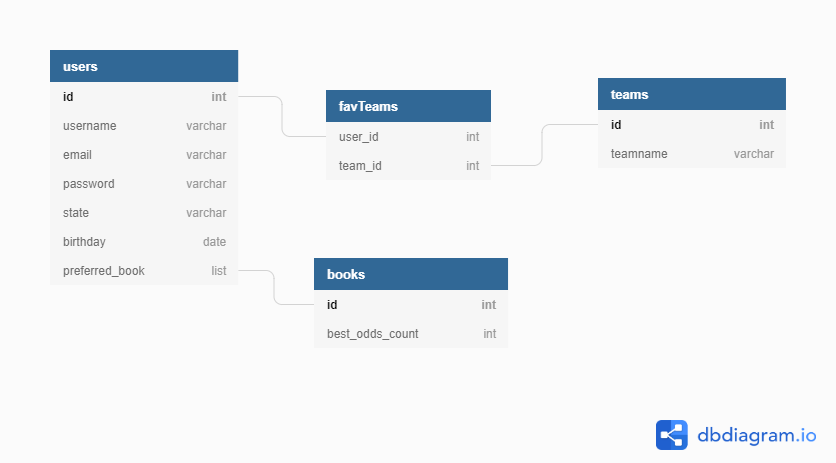

<!-- Prompt: What goal will your website be designed to achieve? -->

1. Online Sports betting is now mostly legal in the US. In fact, there are many competing sports gambling sites that post
different odds for each game. I'd like to provide the user a site that will (a) Prioritize showing the h2h odds of their favorite
teams for all the big gambling sites, and (b) point out what site has the best odd's for each particular game that day, so if they 
decide to put money on the game, they would know what site would give them the best bang for their buck. I'll be keeping the scope
to just NBA basketball at this time, as it is currently in season and the smaller scope will help both me and finding a niche.

<!-- Prompt: What kind of users will visit your site? In other words, what is the demographic of
your users? -->

2. The casual hobby fan/gambler to pretty serious sportsmen. In my mind I see a big fan of an NBA team who has a great feeling
about that night's game and wants to see if they can invest in their confidence. So ideally they would have an easy place to see
everything they need to know to decide if to and how to chose to gamble their money. Someone who is a bigger gambler/NBA fanatic as a whole
will be able to see that night's whole slate of games and get a clear picture what sports books has the best odds for that nights slate of picks.

<!-- Prompt:  What data do you plan on using? You may have not picked your actual API yet,
which is fine, just outline what kind of data you would like it to contain. -->

3. I found a great freemium API that gives odds to almost all sports. There are so many variations in betting I'll sticking to just their americanized head 2 head information for the top 6 sportsbooks

<!-- Prompt: In brief, outline your approach to creating your project (knowing that you may not
know everything in advance and that these details might change later) -->

4a. Database Schema - 
      
Pretty simple stuff. Had big ideas but keeping it simple for now. I'll list some of my grander ideas for the site at the end of this document

4b. Potential API Issues - Well, most obvious issue is that it's freemium. After 500 GET requests in a month we'll have to wait til the next month to get up and running again. This probably won't be an issue but we'll see huh. Besides that, very straightforward so as long as the API is working, the site will be fine

4c. Sensitive Information - I will requiring a secure password. Luckily Colt's code has made it real clear and nice how to do that. I think I will require someone to be logged in to use the functionality of the site, as I'd like to make sure they're 21 and for the practice

4d. a list of all NBA games happening in next 2 days, with their head2head (gambling term, essentially how much you'll make if you bet on the favorite or underdog) information for most the big sports betting sights. The users favorite teams will be prioritzed, as well as certainer hightlighters on sites with the best odds. The shown list will be sortable (sorted ideas: Time to Tip-off, Biggest Underdogs, Just Your Teams)

4e. User Flow- Nice landing page. If not logged in, you'll get a prompt to login or sign up. After doing so, you'll see your 
favorite teams games and information first, then either follow a link or sroll down to see the rest of the leagues games.

4f. More than just absolute CRUD? - Ideally by highlighting best odds and sorting best odds, that raises above the crud. Ideally I'd like to gather fun statistical information, like what teams are most popular with the user base and which sportsbook posts the best odds consistently.
Stretch goals I originally pondered implementing was essentially making it more of a betting simulator. You would start your profile off with an amount of fictional money, and essentially bet on games within the app using the real world odds. Once you hit a certain amount of winnings I could add a little confetti effect in, or more likely, once you lose the money, I could have the user have to ask their "digital mother or father" for more and have some sort of random generator on how much they may or may not get. The biggest barrier to getting something like this now is that there are no free APIs that could get me both game odds and final game scores. The one's out there arent terribly expensive small scale but I would prefer to stay free at this point. Not to mention to actually implement this idea might be outside of range for now as well. If anyone has any suggestions on feasible features I could add, especially for some flare, let me know!
